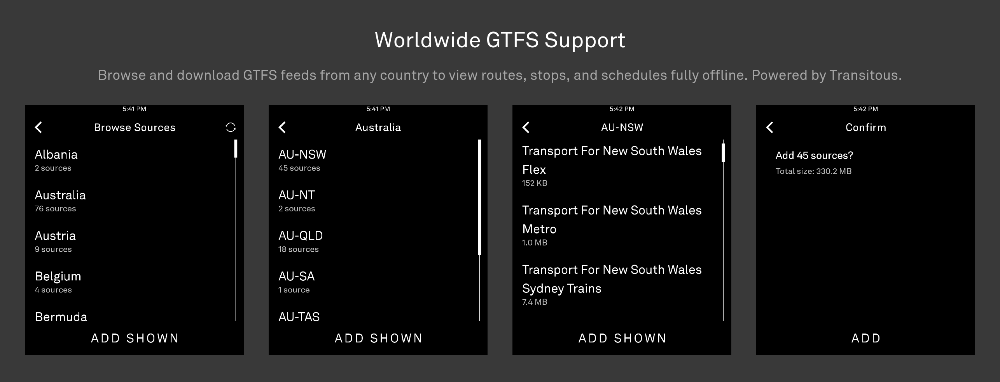
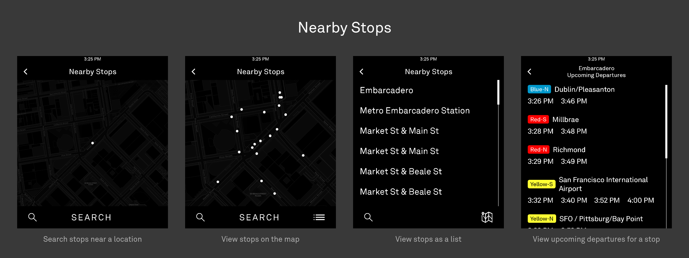
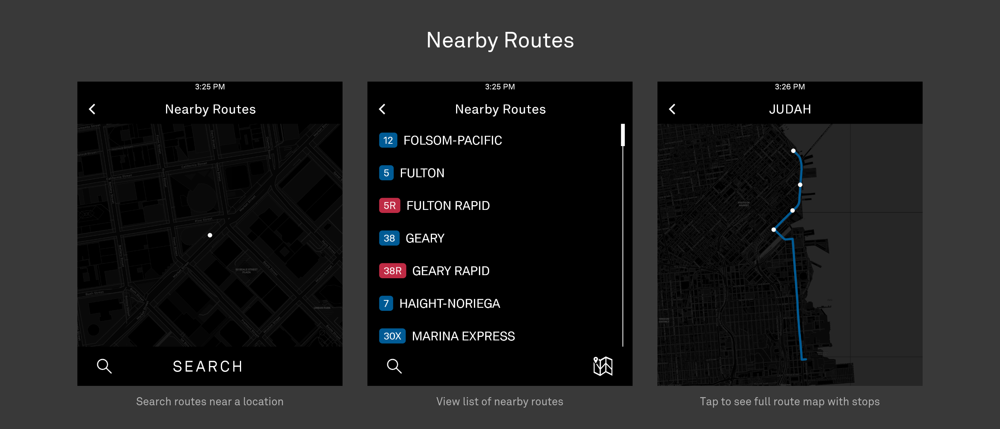
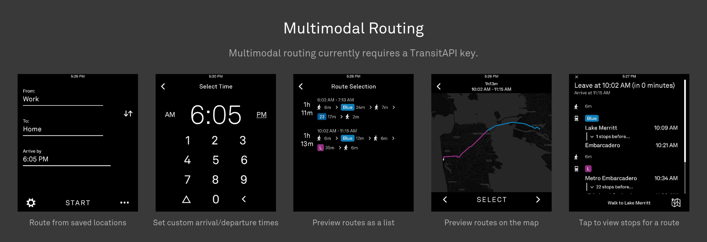

# Light Transit

A transit app for the Light Phone III.


## Features









## Usage and installation

Currently, the APK must be compiled.

Obtain a TransitAPI key, and in `local.properties`:

```sh
TRANSIT_API_KEY=YourKeyHere
```

## Roadmap

- Implemented
  - Global GTFS support
  - View stops, routes, and scheduled departures from locally-downloaded GTFS feeds
  - Multimodal routing with user-provided TransitAPI key
- Planned
  - Realtime vehicle and schedule updates
  - Multimodal routing *without* requiring an API key
  - Shared micromobility support (e.g. bikeshare)
  - Vector map tile support
  - Live position and heading indicators
